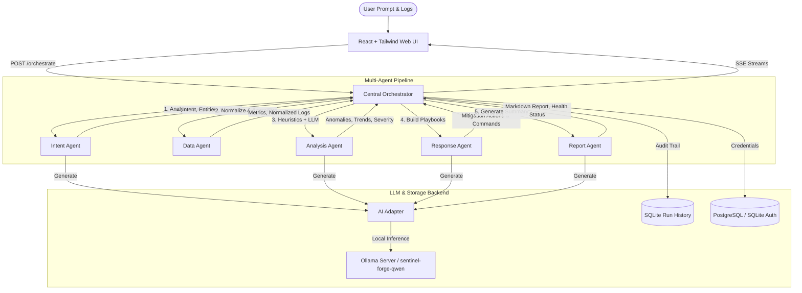

# 🛡️ Sentinel Forge
> **AI-Powered Multi-Agent Log Intelligence & Automated Incident Response System**

Sentinel Forge is an advanced, distributed multi-agent log analysis and mitigation platform. It automatically processes unstructured log streams of any format, identifies security threats, system anomalies, or performance bottlenecks using a hybrid of rule-based heuristics and local LLMs (like Qwen or Llama via Ollama), and generates actionable mitigation commands and executive playbooks in real-time.

---

## 🧭 Architecture Overview

Sentinel Forge is built as a microservices architecture coordinated by a central orchestrator. It uses Server-Sent Events (SSE) to stream live progress to the frontend as each agent executes.



---

## ✨ Key Capabilities

1. **Natural Language Intent Extraction (Intent Agent)**
   * Parses natural language security commands/queries in any language into structured parameters.
   * Classifies inputs into predefined categories: `Security`, `Performance`, `Availability`, `Compliance`, or `Usage Analytics`.
   * Automatically extracts entities (IPs, users, target resources) and condition thresholds/time windows.

2. **Universal Log Normalizer (Data Agent)**
   * Auto-detects log formats: Syslog, Nginx/Apache Combined, Windows Event Logs, Linux Auth, Firewall, CSV, and raw JSON.
   * Performs timezone-aware parsing and clean-up of empty values.
   * Generates deep statistical aggregations including log level distributions, unique client counts, user histograms, and top offending IPs.

3. **Hybrid Security Intelligence (Analysis Agent)**
   * Runs a high-performance **deterministic rule engine** to immediately identify brute-force attacks, DDoS profiles, high error ratios, and malicious signatures.
   * Cascades to local LLM analysis for trend evaluation and semantic anomaly discovery, automatically skipping the LLM call if heuristics trigger high-confidence detections to ensure maximum speed.

4. **Automated Incident Mitigation (Response Agent)**
   * Translates anomalies into concrete, actionable operations: `Block IP` (e.g. iptables rules), `Restart Service`, `Adjust Firewall`, `Capacity Increase`, or `Send Notification`.
   * Automatically extracts IPs mentioned in unstructured text to compile firewall block lists.

5. **Executive Reporting (Report Agent)**
   * Synthesizes metrics, anomalies, and Response Agent playbooks into an executive-ready Markdown summary.
   * Establishes a system health level (`Good`, `Warning`, `Bad`) mapped to analysis severity.

---

## 📂 Project Directory Structure

```text
├── backend/                       # Python microservices backend
│   ├── orchestrator/              # Central coordinate node and SQLite history audit
│   │   ├── main.py                # Pipeline execution, SSE streaming, authentication routes
│   │   └── simulator.py           # Multi-scenario raw log generation script
│   ├── agent_intent/              # Natural language prompt query classifier service
│   ├── agent_data/                # Universal parser, normalizer, and aggregator
│   ├── agent_analysis/            # Heuristics rule engine & LLM anomaly evaluator
│   ├── agent_response/            # Incident playbook and firewall mitigation generator
│   ├── agent_report/              # Executive Markdown summary compiler
│   └── shared/                    # Shared types, custom AI adapter, and JSON extraction utils
├── frontend/                      # React SPA UI client
│   ├── src/                       # Components, SSE logs subscriber, visualization dashboard
│   ├── vite.config.js             # Vite development configurations
│   └── index.html                 # App layout configuration with Tailwind CSS integrations
├── finetuning_a_model/            # Custom LLM Fine-Tuning Workspace (RTX 4050 6GB VRAM optimized)
│   ├── prepare_dataset.py         # Multi-agent prompt-dataset generation script
│   ├── train.py                   # LoRA adapters training pipeline script
│   ├── export_and_merge.py        # Merge LoRA adapters into base weights
│   ├── Modelfile                  # Ollama manifest configuration
│   └── model_deployment.md        # GGUF compilation and Ollama hosting guide
└── docker-compose.yml             # Distributed multi-container orchestrator configuration
```

---

## 🚀 Docker Compose Quickstart

To run the entire distributed architecture including the Central Orchestrator, all 5 Agents, and the React frontend:

### Prerequisites
1. Install [Docker](https://www.docker.com/products/docker-desktop/) and Docker Compose.
2. Install and run [Ollama](https://ollama.com/) locally on the host machine.
3. Pull your default model:
   ```bash
   ollama pull llama3
   ```

### 1. Build and Launch Services
From the project root directory, run:
```bash
docker compose up --build
```
This builds and starts the following components:
* **Frontend Dashboard**: Hosted at `http://localhost:5173` (or the next available port).
* **Central Orchestrator**: API exposed at `http://localhost:8000`.
* **Agent Intent**: API exposed at `http://localhost:8001`.
* **Agent Data**: API exposed at `http://localhost:8002`.
* **Agent Analysis**: API exposed at `http://localhost:8003`.
* **Agent Response**: API exposed at `http://localhost:8005`.
* **Agent Report**: API exposed at `http://localhost:8004`.

*Note: The agents will communicate with Ollama running on the host system via their configured adapter endpoints.*

---

## 🖥️ Desktop Client Application (Electron)

Sentinel Forge includes a cross-platform desktop wrapper application built using **Electron**, allowing the log intelligence console to run as a native desktop utility.

### Build & Package Desktop Executable

1. **Build the React Frontend** (if not already done):
   ```bash
   cd frontend
   npm run build
   ```

2. **Package the Native Installer**:
   From the desktop directory:
   ```bash
   cd ../desktop
   npm install
   npm run package
   ```
   This copies the compiled frontend bundle and packages a standalone executable (`.exe` for Windows) inside the `dist-app/` directory.

3. **Running in Developer Mode**:
   To load the application pointing to your Vite dev server:
   ```bash
   npm start
   ```

---

## 🧠 Local Custom LLM Fine-Tuning

Sentinel Forge includes a dedicated workspace to fine-tune a model (`sentinel-forge-qwen`) tailored specifically for log analysis parameters, optimized to fit within a consumer-grade **6GB VRAM GPU (e.g. Nvidia RTX 4050)**.

### Step-by-Step Training Pipeline

1. **Initialize the Virtual Environment**
   Open PowerShell inside the project directory and set up a CUDA-compatible environment:
   ```powershell
   cd "c:\Users\Pratham\Downloads\Final Year Project"
   python -m venv venv
   .\venv\Scripts\Activate.ps1
   pip install torch torchvision torchaudio --index-url https://download.pytorch.org/whl/cu121
   pip install transformers peft trl datasets accelerate bitsandbytes
   ```

2. **Generate the Training Set**
   Create a structured dataset of 4,700 high-quality agent-specific examples:
   ```powershell
   python finetuning_a_model/prepare_dataset.py
   ```
   *This outputs `finetuning_a_model/train_data.jsonl` containing structured prompts.*

3. **Execute LoRA Adapters Training**
   Start training model adapters locally. The script is configured to use memory-efficient optimizers and gradient checkpointing to run stably under 6GB VRAM:
   ```powershell
   python finetuning_a_model/train.py
   ```

4. **Merge Weights and Export GGUF**
   Combine your trained LoRA weights back into the float16 base model weights:
   ```powershell
   python finetuning_a_model/export_and_merge.py
   ```
   For detailed instructions on compiling the merged model into GGUF format and deploying it under Ollama, follow the step-by-step guide in:
   👉 **[model_deployment.md](file:///c:/Users/Pratham/Downloads/Final%20Year%20Project/finetuning_a_model/model_deployment.md)**

---

## 🧪 Running Unit Tests

The backend test suite verifies agent responses, JSON extractors, rule-engine triggers, and parser filters. Run tests locally using `pytest`:

1. Activate your virtual environment and install test dependencies:
   ```powershell
   pip install pytest pytest-asyncio httpx
   ```

2. Run all unit tests:
   ```powershell
   pytest backend/ -v
   ```

---

## 🛡️ Database & Auditing

* **Run Audit Trail**: By default, the orchestrator logs pipeline status, payloads, and latency for every run to a local SQLite database (`sentinel_forge.db`).
* **Authentication Fallback Sync**: Supports standard login and registration flows. In production settings, authentication routes operate on PostgreSQL. To prevent user lockout during Postgres outages, registrations and hashes are mirrored in real-time to a local SQLite database backup (`sentinel_forge.db`), enabling automatic fallback auth reads.

---

## 🧹 Interactive UI Controls
The React dashboard UI features modular panels with individual **🧹 Clear** control actions:
* **Prompt Clear**: Resets input questions.
* **Console Audit Clear**: Wipes live agent runtime console logs.
* **File Ingest Clear**: Clears file uploads.
* **Findings & Playbook Clear**: Resets markdown summaries and Response mitigation script panels.
* **Simulator Console Clear**: Resets real-time simulation output buffers.
